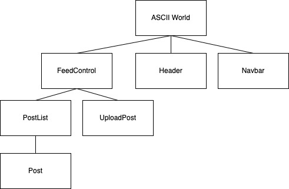

# ASCII World

#### React application for converting images to ASCII format and sharing.

#### By Will Greenberg

## Technologies Used

* HTML
* CSS
* React
* Bootstrap
* React-Bootstrap
* Node.js

## Description

This React web application allows users to upload and convert images to an ASCII art format and post those to the site's feed. Additional functionality will include commenting and liking other users' posts.

## Setup/Installation Requirements

* Clone this repository to your desktop.
* Navigate to directory `ascii-world` in your terminal.
* Run `npm run build` to build the project.
* To run the application, run `npm run start`.
* Navigate to `http://localhost:3000/` in your browser.

## Known Bugs

* None so far.

## Research & Planning Log
### Friday, 4/29
* 8:20: Initialize project
* 8:40: Research and write proposal
* 10:15: Research uploading images in React apps
* 11:00: Watching tutorial on uploading files
* 1:00: Make notes on plan/plannig project.
* 1:45: Watch tutorials on Firebase
* 2:45: Work on component tree
* 3:00: Set up base components of site.
* 4:00: Research tutorials on converting images to ASCII.

### Friday, 5/6
8:15: Review resources.
9:15: Implement Firebase in project.
10:00: Work on uploading images from site
1:00: Work on displaying images
2:00: Implement firestore to track information of images in cloud storage.
3:00: Add redux
4:00: work on displaying images

### Friday, 5/13
8:00: Research
9:00: Switch project from using Redux to Context.
9:30: Implement authentication.
10:15: Research ASCII conversion.

## Provisional Component Tree Diagram

## License

[MIT](https://opensource.org/licenses/MIT)

Copyright (c) 2022 Will Greenberg